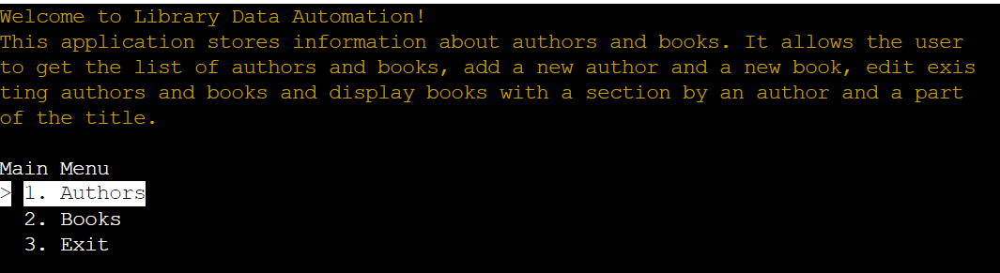
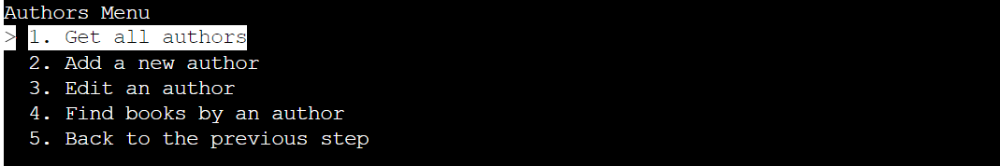
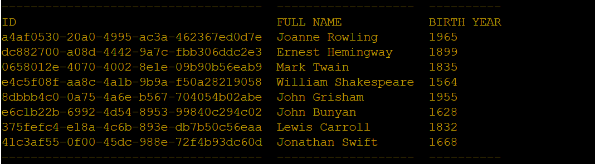
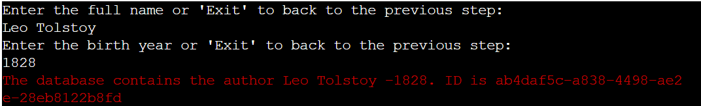
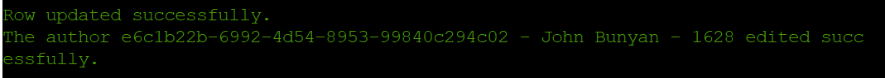
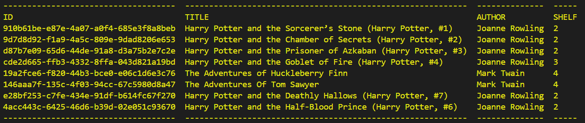
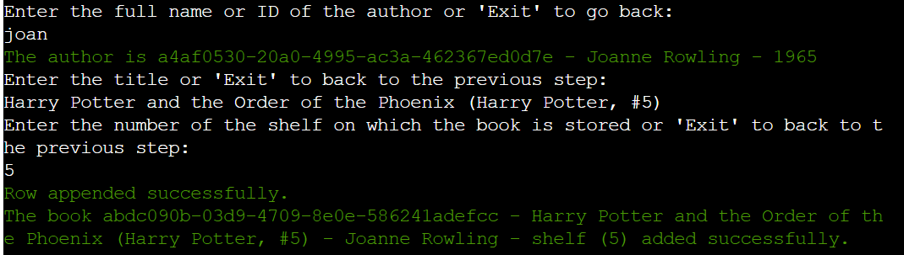

# Library Data Automation

Library Data Automation is a Python terminal application used to store information about authors and books. It allows the user to get the list of authors and books, add a new author and a new book, edit existing authors and books and display books with a section by an author and a part of the title.

The application can be accessed through this [link](https://library2024-806c35817f2e.herokuapp.com/)

## User Stories

__First Time Visitors To The Application__

 - As a new visitor, I want to quickly understand how to use this application.
 - As a new visitor, I want to get a convenient menu to manage this application.
 - As a new visitor, I want to get features allowing to add, edit and get information about authors and books.

__Returning Or Regular Visitors__

 - As a returning or regular user, I want to get saved information about authors and books.
 - As a returning or regular user, I want to have the feature editing saved information.

## Features

### Existing Features

__Start The Application__

The application displays the Welcome message and the Main Menu.
 

__The Main Menu__

The Main menu has three options:
- 1. Authors - open the Authors menu to work with authors.
- 2. Books - open the Books menu to work with books.
- 3. Exit - exits the application and displays the message.
    

__The Authors' Menu__

The Authors' menu has five options.

To choose one of the options, the user has to input the number of the option and press Enter.
- 1. Get all authors - displays all saved authors. The data is displayed in the format "ID (author) - the full name - the birth year"
     
- 2. Add a new author - add a new author to the database.
     - The system asks the user to input the full name of the author and checks that it cannot 
     be empty. The user can input "Exit" to return to the Authors' menu.
     
     - Then the system asks the user to input the birth year of the author and checks that it cannot be empty and has to be an integer. The user can input "Exit" to return to the Authors' menu.
     
     - Then the system checks the database for duplicates and if it is, sends the message.
     
     Finally, the system saves information and sends the message with details.
     
- 3. Edit an author - edit detailed information about the chosen author.
     - The system asks the user to input the full name of the author or the ID of the author, checks that it cannot be empty, finds the author and sends the result's message. The user can input "Exit" to return to the Authors' menu.
     
     - The selection occurs based on the occurrence of a string. If it finds several items, the system asks the user to choose one of them.
     
     - Then the system asks the user to input the new full name of the author. The user can input an empty string not to change the full name or "Exit" to return to the Authors' menu.
     - Then the system asks the user to input the new birth year of the author and checks that it cannot be empty and has to be an integer. The user can input "Exit" to return to the Authors' menu.
     - Finally, the system saves information and sends the message with details.
     
- 4. Find books by an author - displays books with the selection by the author.
     - The system asks the user to input the full name of the author or the ID of the author, checks that it cannot be empty, finds the author and sends the result's message. The user can input "Exit" to return to the Authors' menu. The selection occurs based on the occurrence of a string. If it finds several items, the system asks the user to choose one of them.
     - Then the system displays books in the format "ID (book) - the title - the full name of the author - shelf(the number of the shelf on which the book is stored)".
     
- 5. Back to the previous step - return to the Main menu.

__The Books' Menu__

The Books' menu has five options.

To choose one of the options, the user has to input the number of the option and press Enter.
- 1. Get all books - displays all saved books. The data is displayed in the format "ID (book) - the title - the full name of the author - shelf(the number of the shelf on which the book is stored)"
     
- 2. Add a new book - add a new book to the database.
     
     - The system asks the user to input the full name of the author or the ID of the author, checks that it cannot be empty, finds the author and sends the result's message. The user can input "Exit" to return to the Books' menu. The selection occurs based on the occurrence of a string. If it finds several items, the system asks the user to choose one of them.
     - Then The system asks the user to input the title and checks that it cannot 
     be empty. The user can input "Exit" to return to the Books' menu.
     - Then The system asks the user to input the the number of the shelf on which the book is stored and checks that it cannot be empty. The user can input "Exit" to return to the Books' menu.
     - Then the system checks the database for duplicates and if it is, sends the message.
     
     - Finally, the system saves information and sends the message with details.
     
- 3. Edit a book - edit detailed information about the chosen book.
     - The system asks the user to input the full name of the author or the ID of the author, checks that it cannot be empty, finds the author and sends the result's message. The user can input "Exit" to return to the Books' menu. The selection occurs based on the occurrence of a string. If it finds several items, the system asks the user to choose one of them.
     - Then the system asks the user to input the title of the book or ID of the book and checks that it cannot be empty. The user can input "Exit" to return to the Books' menu.
     - Then the system finds the book and sends the result's message.
      
     - Then the system asks the user to input the new title of the book. The user can input an empty string not to change the title or "Exit" to return to the Books' menu.
     - Then The system asks the user to input the the number of the shelf on which the book is stored and checks that it cannot be empty. The user can input "Exit" to return to the Books' menu.
     - Finally, the system saves information and sends the message with details.
     
- 4. Find books by part of the title - displays books based on the occurrence of a string.
     - The system asks the user to input the title.
     - Then the system finds books by part of the title.
     
- 5. Back to the previous step - return to the Main menu.

## Technologies Used

### Programming Language
- [Python 3.12.2](https://www.python.org/downloads/release/python-3122/): A versatile and widely-used programming language known for its readability and extensive libraries. This project is primarily built using Python due to its powerful data manipulation capabilities and ease of integration with other technologies.
### Libraries and Frameworks
- [gspread](https://docs.gspread.org/en/v6.0.0/): A Python library that provides easy access to Google Sheets API. It allows for seamless reading, writing, and updating of Google Sheets.
- [google-auth](https://google-auth.readthedocs.io/en/master/): A library to authenticate and authorize Google APIs. Specifically, google.oauth2.service_account is used to handle service account credentials for secure access to Google Sheets.
- [uuid](https://docs.python.org/3/library/uuid.html): A Python library used to generate unique identifiers for records, ensuring that each entry in the Google Sheets has a unique ID.
### Google Cloud Platform
- [Google Sheets API](https://developers.google.com/sheets/api/quickstart/python?hl=en): An API provided by Google that allows interaction with Google Sheets. This project leverages the API to read, write, and manage data stored in Google Sheets.
- [Google Drive API](https://developers.google.com/drive/api/quickstart/python?hl=en): Used for additional operations related to file management in Google Drive, complementing the Google Sheets API functionalities.
### Google Cloud Platform
- [VS Code](https://code.visualstudio.com/): Popular Integrated Development Environments (IDEs) that provide robust support for Python development, including code completion, debugging, and version control integration.
- [Github](https://github.com/) - A version control system used to manage code changes and collaborate with other developers.
### Authentication and Security
- [OAuth 2.0](https://oauth.net/2/): An authorization framework used to obtain limited access to user accounts on an HTTP service. This project uses OAuth 2.0 to securely access Google Sheets data through a service account.
### Data Formats
- [JSON](https://www.json.org/json-en.html): Used for configuration and data exchange. The credentials for the Google service account are stored in a JSON file, and JSON is also used for structured data interchange.

## Testing

Please refer to the [TESTING.md](TESTING.md) file for all test-related documentation.

## Deployment

### Prerequisites
Before running the application locally, ensure you have the following installed:
- Python (preferably the latest version, check the version with python --version).
- pip (Python package installer, included with Python installations).
- Git (for cloning the repository).
### Steps to Deploy Locally
- Clone the Repository
  git clone https://github.com/BogdanovaIV/library.git
  cd library
- Create the creds.json File. Ensure you have the creds.json file, which contains your Google API credentials. Place the creds.json in the project directory
- Install Dependencies. Install the required packages listed in the requirements.txt file:
  pip install -r requirements.txt
- Run the Application. Run your main application script.
  python run.py