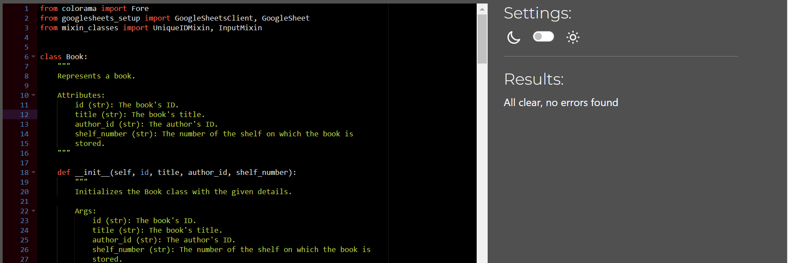
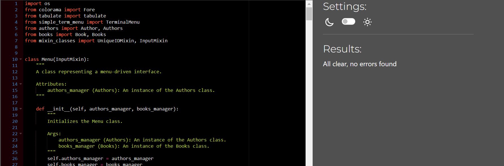
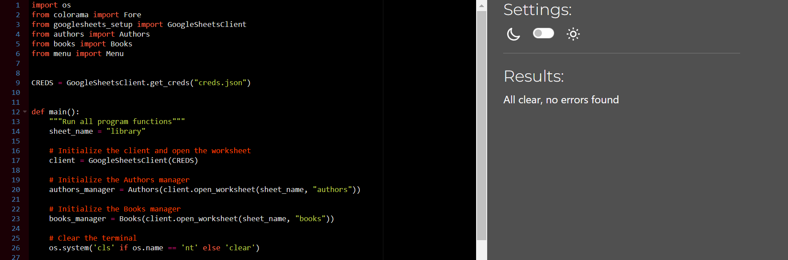

## TESTING

### Purpose Of Testing

The purpose of testing is to make sure the application does not have critical errors and works properly, providing a positive experience for the user.

__Functional Testing__

All the options were tested and worked correctly.

| feature | action | expected result | tested | passed | comments |
| --- | --- | --- | --- | --- | --- |
| The Main Menu | | | | | |
| Start the application  | Start the application | The application displays the Welcome message and the Main Menu | Yes | Yes | - |
| The option "Authors" | Input 1 to select the option | The system displays the Authors' menu to work with authors | Yes | Yes | - |
| The option "Books" | Input 2 to select the option | The system displays the Books' menu to work with books | Yes | Yes | - |
| The option "Exit" | Input 3 to select the option | The system exits the application and displays the message. | Yes | Yes | - |
| The Authors' Menu | | | | | |
| Display the Authors' Menu  | Display the Authors' Menu | The Authors' menu has five options. | Yes | Yes | - |
| The option "Get all authors" | Input 1 to select the option | The system goes to the next step | Yes | Yes | - |
| Display authors | Displays all saved authors | Displays all saved authors. The data is displayed in the format "ID (author) - the full name - the birth year" | Yes | Yes | - |
| The option "Add a new author" | Input 2 to select the option | The system goes to the next step | Yes | Yes | - |
| Input the full name of the author  | Input the full name of the author | The user can input the full name of the author. The user can input "Exit" to return to the Authors' menu. The system checks that it cannot be empty.  | Yes | Yes | - |
| Input the birth year of the author | Input the birth year of the author | The user can input the birth year of the author. The user can input "Exit" to return to the Authors' menu. The system checks that it cannot be empty and has to be an integer.  | Yes | Yes | - |
| Checks the database for duplicates | Input the data that is in the database | The system checks the database for duplicates and if it is, sends the message with the ID of an existing item. | Yes | Yes | - |
| Save the author in the database | Input the data that is not in the database | The system saves information and sends the message with details. | Yes | Yes | - |
| The option "Edit an author" | Input 3 to select the option | The system goes to the next step | Yes | Yes | - |
| Input the full name of the author or the ID of the author  | Input the full name of the author or the ID of the author | The user can input the full name of the author or the ID of the author. The user can input "Exit" to return to the Authors' menu. The system checks that it cannot be empty, finds the author, and sends the result's message.  | Yes | Yes | - |
| Input the part of the full name of the author | Input the part of the full name of the author | The user can input the part of the full name of the author. The user can input "Exit" to return to the Authors' menu. The system checks that it cannot be empty, finds the author, and sends the result's message. The selection occurs based on the occurrence of a string. If it finds several items, the system asks the user to choose one.  | Yes | Yes | - |
| Input the new full name of the author | Input the new full name of the author | The user can input the new full name of the author or the ID of the author. The user can input "Exit" to return to the Authors' menu. The user can input an empty string not to change the full name. | Yes | Yes | - |
| Input the birth year of the author | Input the birth year of the author | The user can input the birth year of the author. The user can input "Exit" to return to the Authors' menu. The system checks that it cannot be empty and has to be an integer.  | Yes | Yes | - |
| Save the author in the database | Input the data that is not in the database | The system saves information and sends the message with details. | Yes | Yes | - |
| The option "Find books by an author" | Input 4 to select the option | The system goes to the next step | Yes | Yes | - |
| Input the full name of the author or the ID of the author  | Input the full name of the author or the ID of the author | The user can input the full name of the author or the ID of the author. The user can input "Exit" to return to the Authors' menu. The system checks that it cannot be empty, finds the author, and sends the result's message.  | Yes | Yes | - |
| Input the part of the full name of the author | Input the part of the full name of the author | The user can input the part of the full name of the author. The user can input "Exit" to return to the Authors' menu. The system checks that it cannot be empty, finds the author and sends the result's message. The selection occurs based on the occurrence of a string. If it finds several items, the system asks the user to choose one.  | Yes | Yes | - |
| Displays books | Displays books | The system displays books in the format "ID (book) - the title - the full name of the author - shelf(the number of the shelf on which the book is stored)".  | Yes | Yes | - |
| The option "Back to the previous step" | Input 5 to select the option | The system returns to the Main menu | Yes | Yes | - |
| The Books' Menu | | | | | |
| Display the Books' Menu  | Display the Books' Menu | The Books' menu has five options. | Yes | Yes | - |
| The option "Get all books" | Input 1 to select the option | The system goes to the next step | Yes | Yes | - |
| Display books  | Displays all saved books | Displays all saved books. The data is displayed in the format "ID (book) - the title - the full name of the author - shelf(the number of the shelf on which the book is stored)" | Yes | Yes | - |
| The option "Add a new book" | Input 2 to select the option | The system goes to the next step | Yes | Yes | - |
| Input the full name of the author or the ID of the author  | Input the full name of the author or the ID of the author | The user can input the full name of the author or the ID of the author. The user can input "Exit" to return to the Books' menu. The system checks that it cannot be empty, finds the author and sends the result's message.  | Yes | Yes | - |
| Input the part of the full name of the author | Input the part of the full name of the author | The user can input the part of the full name of the author. The user can input "Exit" to return to the Books' menu. The system checks that it cannot be empty, finds the author, and sends the result's message. The selection occurs based on the occurrence of a string. If it finds several items, the system asks the user to choose one.  | Yes | Yes | - |
| Input the title of the books  | Input the title of the book | The user can input the title of the book. The user can input "Exit" to return to the Books menu. The system checks that it cannot be empty.  | Yes | Yes | - |
| Input the number of the shelf on which the book is stored | Input the number of the shelf on which the book is stored | The user can input the number of the shelf on which the book is stored. The user can input "Exit" to return to the Books' menu. The system checks that it cannot be empty and has to be an integer.  | Yes | Yes | - |
| Checks the database for duplicates | Input the data that is in the database | The system checks the database for duplicates and if it is, sends the message with the ID of an existing item. | Yes | Yes | - |
| Save the book in the database | Input the data that is not in the database | The system saves information and sends the message with details. | Yes | Yes | - |
| The option "Edit a new book" | Input 3 to select the option | The system goes to the next step | Yes | Yes | - |
| Input the full name of the author or the ID of the author  | Input the full name of the author or the ID of the author | The user can input the full name of the author or the ID of the author. The user can input "Exit" to return to the Books' menu. The system checks that it cannot be empty, finds the author and sends the result's message.  | Yes | Yes | - |
| Input the part of the full name of the author | Input the part of the full name of the author | The user can input the part of the full name of the author. The user can input "Exit" to return to the Books' menu. The system checks that it cannot be empty, finds the author, and sends the result's message. The selection occurs based on the occurrence of a string. If it finds several items, the system asks the user to choose one.  | Yes | Yes | - |
| Input the title of the book or the ID of the book  | Input the title of the book or the ID of the book | The user can input the title of the book or the ID of the book. The user can input "Exit" to return to the Books' menu. The system checks that it cannot be empty, finds the book and sends the result's message.  | Yes | Yes | - |
| Input the part of the title of the book | Input the part of the title of the book | The user can input the part of the title of the book. The user can input "Exit" to return to the Books' menu. The system checks that it cannot be empty, finds the book, and sends the result's message. The selection occurs based on the occurrence of a string. If it finds several items, the system asks the user to choose one.  | Yes | Yes | - |
| Input the new title of the books  | Input the new title of the book | The user can input the new title of the book. The user can input "Exit" to return to the Books menu. The user can input an empty string not to change the title.  | Yes | Yes | - |
| Input the new number of the shelf on which the book is stored | Input the new number of the shelf on which the book is stored | The user can input the new number of the shelf on which the book is stored. The user can input "Exit" to return to the Books' menu. The system checks that it cannot be empty and has to be an integer.  | Yes | Yes | - |
| Save the book in the database | Input the data that is not in the database | The system saves information and sends the message with details. | Yes | Yes | - |
| The option "Find books by part of the title" | Input 4 to select the option | The system goes to the next step | Yes | Yes | - |
| Input the part of the title of the book | Input the part of the title of the book | The user can input the part of the title of the book. The user can input "Exit" to return to the Books' menu. | Yes | Yes | - |
| Displays books | Displays books | The system displays books in the format "ID (book) - the title - the full name of the author - shelf(the number of the shelf on which the book is stored)".  | Yes | Yes | - |
| The option "Back to the previous step" | Input 5 to select the option | The system returns to the Main menu | Yes | Yes | - |
The Google Sheets contains all the data which added.
- Authors

- Books

## Validator
Quality checking was tested by [PEP8](https://pep8ci.herokuapp.com/#).
All files were checked and did not have errors and warnings.
Notes: Each python files contains  a newline at the end of the file
- authors.py
 
 - books.py
 
 - googlesheets_setup.py
 
 - menu.py
 
 - mixin_classes.py
 
 - run.py
 - run.py
 

## Bugs

__Solved Bugs__

 - Wrong searching books by the author and a part of the title
   Solution: Add two types of selection: any and all to "Books.get_all_books_with_selection"
   
 - Display tables with information about authors and books without headings.
   Solution: add to classes "Authors" and "Books" functions "get_headers_for_table".
   
 - The user cannot edit the book without inputting "new title".
   Solution: Add the option if the user inputs an empty string, the system does not change title  
   
__Unsolved Bugs__

 - None.

__Mistakes__

 - Using different formats of 'Commit' comments.
 - Some grammar and spelling mistakes.